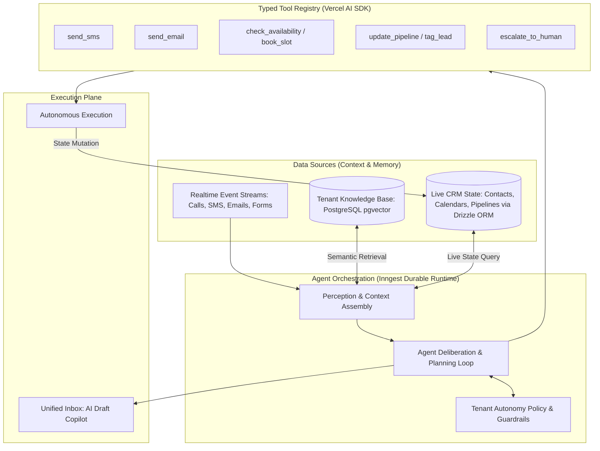
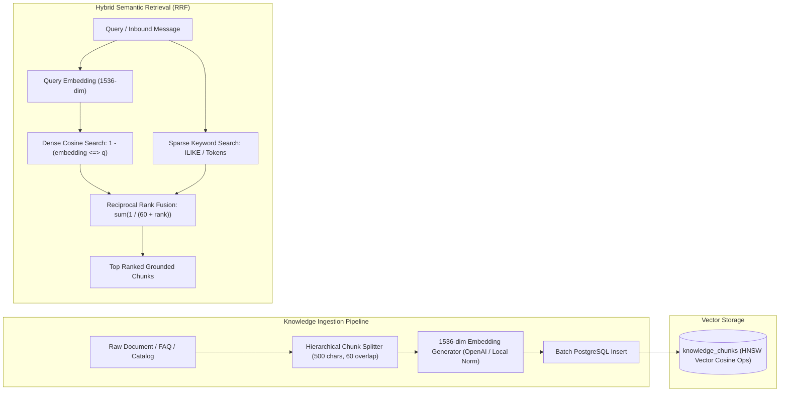
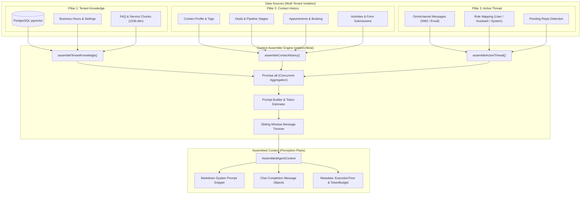
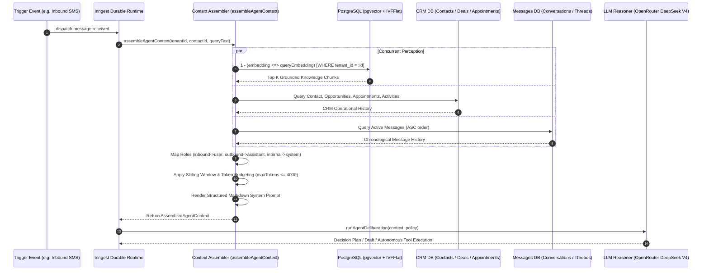
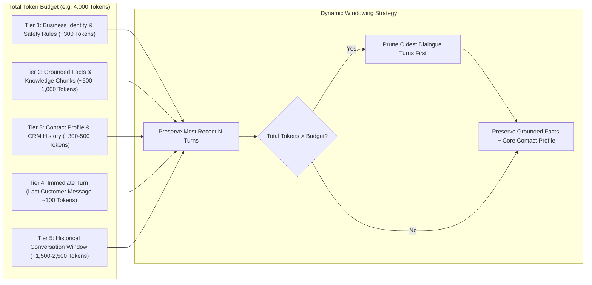
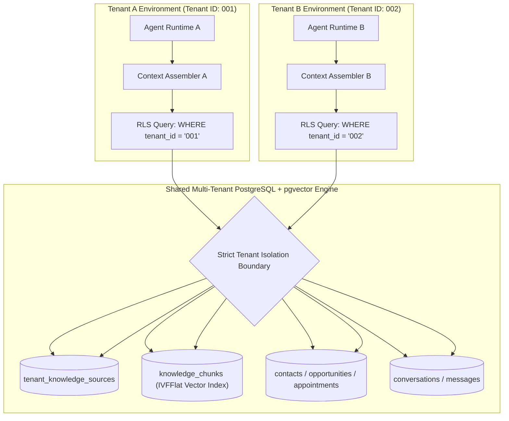

# HighReach AI-Native Architecture Specification

## 1. Executive Summary & Core Philosophy

### From Entity-Relational to Data Source & Agent Architecture
Traditional SaaS applications (Web 2.0) are structured around **rigid Entity-Relationship Diagrams (ERDs)** and **imperative business logic**:
- **Traditional Model**: Tables $\to$ Foreign Keys $\to$ Hardcoded Services $\to$ Static Views. Every state transition is explicitly coded by a software engineer (`if event == missed_call then send template`).
- **AI-Native Model**: **Data Sources** $\leftrightarrow$ **Autonomous Agents** $\leftrightarrow$ **Typed Tools**. Software is structured around grounded business context and autonomous decision-makers capable of observing, planning, and taking authorized actions.



---

## 2. The Three Core Primitives

### Primitive 1: Data Sources (Context & Memory)
Instead of treating the database only as a place to store rows, an AI-native system uses data sources as **living perception and memory feeds**:

1. **Unstructured Knowledge Base (Semantic Memory)**:
   - Business hours, pricing sheets, FAQ docs, service descriptions, warranty details.
   - Stored in PostgreSQL using `pgvector` (`vector(1536)`), managed directly through Drizzle ORM.
   - Queried via Cosine Similarity / Hybrid Search to ground agent responses in verified business facts.
2. **Structured Operational State (Working Context)**:
   - Contact record, tags, previous communications, deal stage, and calendar booking availability.
   - Retrieved at execution time and injected into the agent's working prompt.
3. **Episodic Memory**:
   - History of prior agent decisions, user sentiment, and outcomes for a given contact.
4. **Event Streams**:
   - Inbound Webhooks: Telnyx SMS received, call missed, Resend email replied, form submitted.

---

### Primitive 2: Autonomous Agents (Reasoners & Policies)
Agents are goal-directed orchestrators executing with clear system prompts, persona guidelines, and safety policies:

| Agent | Goal | Default Trigger | Permitted Tools |
| :--- | :--- | :--- | :--- |
| **Speed-to-Lead Agent** | Engage new leads within 60s, answer initial inquiries, and qualify interest. | `contact.created`, `form.submitted`, `call.missed` | `send_sms`, `update_pipeline`, `escalate_to_human` |
| **Booking Concierge** | Coordinate dates/times and confirm appointments directly into connected calendars. | Inbound customer intent to schedule | `check_calendar_availability`, `book_appointment`, `send_sms`, `send_email` |
| **Review Guardian** | Analyze customer sentiment, auto-draft responses, and escalate negative feedback. | `review.created` (Google / Facebook) | `generate_review_response`, `post_review_reply`, `create_internal_ticket` |

---

### Primitive 3: Typed Tool Registry (Action Capabilities)
Platform capabilities are not hidden in private controller endpoints; they are exposed as **strongly typed tools** adhering to standard schema definitions (Zod + Vercel AI SDK):

```typescript
import { tool } from "ai";
import { z } from "zod";
import { telnyx } from "@/lib/telnyx";
import { db, contacts, tenants, messages } from "@/lib/db";
import { eq } from "drizzle-orm";

export const sendSmsTool = tool({
  description: "Send an SMS text message to a contact on behalf of the business",
  parameters: z.object({
    contactId: z.string().uuid().describe("The ID of the contact recipient"),
    message: z.string().min(1).max(1600).describe("The SMS message text"),
  }),
  execute: async ({ contactId, message }) => {
    // 1. Fetch Contact via Drizzle ORM
    const contact = await db.query.contacts.findFirst({
      where: eq(contacts.id, contactId),
    });
    if (!contact?.phone) throw new Error("Contact has no phone number");

    // 2. Fetch Tenant Phone via Drizzle ORM
    const tenant = await db.query.tenants.findFirst({
      where: eq(tenants.id, contact.tenantId),
    });
    const senderNumber = tenant?.phoneNumber;
    if (!senderNumber) throw new Error("Tenant has no assigned phone number");

    // 3. Dispatch SMS via Telnyx
    const res = await (telnyx.messages as any).create({
      from: senderNumber,
      to: contact.phone,
      text: message,
    });

    // 4. Record outbound message in unified inbox thread
    await db.insert(messages).values({
      tenantId: contact.tenantId,
      contactId: contactId,
      direction: "outbound",
      channel: "sms",
      content: message,
      senderType: "agent",
    });

    return { success: true, messageId: res.data.id };
  },
});
```

---

## 3. Database Schema (PostgreSQL + pgvector with Drizzle ORM)

To support the Data Source $\leftrightarrow$ Agent model, the schema is implemented in **PostgreSQL** using `pgvector` and mapped in **Drizzle ORM** (`web/src/lib/db/schema.ts`):

### Drizzle ORM Schema Definition

```typescript
import { pgTable, uuid, text, timestamp, boolean, integer, numeric, jsonb, index, vector } from "drizzle-orm/pg-core";
import { tenants, contacts } from "./schema";

// 1. Knowledge Sources (Tenant Documents, FAQs, Webpages)
export const tenantKnowledgeSources = pgTable("tenant_knowledge_sources", {
    id: uuid("id").primaryKey().defaultRandom(),
    tenantId: uuid("tenant_id").references(() => tenants.id, { onDelete: "cascade" }).notNull(),
    title: text("title").notNull(),
    sourceType: text("source_type").notNull(), // 'faq' | 'document' | 'url' | 'service_catalog'
    rawContent: text("raw_content").notNull(),
    metadata: jsonb("metadata").default({}),
    createdAt: timestamp("created_at", { withTimezone: true }).defaultNow().notNull(),
    updatedAt: timestamp("updated_at", { withTimezone: true }).defaultNow().notNull(),
}, (table) => [
    index("idx_knowledge_sources_tenant").on(table.tenantId),
]);

// 2. Document Embeddings (Chunked Semantic Vectors)
export const knowledgeChunks = pgTable("knowledge_chunks", {
    id: uuid("id").primaryKey().defaultRandom(),
    sourceId: uuid("source_id").references(() => tenantKnowledgeSources.id, { onDelete: "cascade" }).notNull(),
    tenantId: uuid("tenant_id").references(() => tenants.id, { onDelete: "cascade" }).notNull(),
    content: text("content").notNull(),
    embedding: vector("embedding", { dimensions: 1536 }).notNull(), // OpenAI / text-embedding-3-small
    tokenCount: integer("token_count"),
    createdAt: timestamp("created_at", { withTimezone: true }).defaultNow().notNull(),
}, (table) => [
    index("idx_knowledge_chunks_tenant").on(table.tenantId),
    index("idx_knowledge_chunks_source").on(table.sourceId),
    index("knowledge_chunks_embedding_idx").using("hnsw", table.embedding.op("vector_cosine_ops")),
]);

// 3. Agent Configurations & Policies
export const agentConfigs = pgTable("agent_configs", {
    id: uuid("id").primaryKey().defaultRandom(),
    tenantId: uuid("tenant_id").references(() => tenants.id, { onDelete: "cascade" }).notNull(),
    agentType: text("agent_type").notNull(), // 'lead_qualifier' | 'booking_concierge' | 'review_guardian'
    isActive: boolean("is_active").default(false).notNull(),
    autonomyMode: text("autonomy_mode").default("draft_only").notNull(), // 'draft_only' | 'auto_pilot'
    systemPromptOverride: text("system_prompt_override"),
    confidenceThreshold: numeric("confidence_threshold").default("0.85").notNull(),
    createdAt: timestamp("created_at", { withTimezone: true }).defaultNow().notNull(),
    updatedAt: timestamp("updated_at", { withTimezone: true }).defaultNow().notNull(),
}, (table) => [
    index("idx_agent_configs_tenant").on(table.tenantId),
]);

// 4. Agent Execution Audit Log (Traces & Memory)
export const agentRuns = pgTable("agent_runs", {
    id: uuid("id").primaryKey().defaultRandom(),
    tenantId: uuid("tenant_id").references(() => tenants.id, { onDelete: "cascade" }).notNull(),
    agentType: text("agent_type").notNull(),
    contactId: uuid("contact_id").references(() => contacts.id, { onDelete: "set null" }),
    triggerEvent: text("trigger_event").notNull(),
    status: text("status").notNull(), // 'running' | 'completed' | 'draft_pending' | 'failed' | 'escalated'
    inputContext: jsonb("input_context").notNull(),
    reasoningSteps: jsonb("reasoning_steps").default([]),
    actionsTaken: jsonb("actions_taken").default([]),
    draftOutput: text("draft_output"),
    humanApproved: boolean("human_approved"),
    createdAt: timestamp("created_at", { withTimezone: true }).defaultNow().notNull(),
}, (table) => [
    index("idx_agent_runs_tenant").on(table.tenantId),
    index("idx_agent_runs_contact").on(table.contactId),
]);
```

### Underlying PostgreSQL DDL Migration

```sql
-- 1. Enable pgvector extension
CREATE EXTENSION IF NOT EXISTS vector;

-- 2. Knowledge Sources
CREATE TABLE tenant_knowledge_sources (
    id UUID PRIMARY KEY DEFAULT gen_random_uuid(),
    tenant_id UUID NOT NULL REFERENCES tenants(id) ON DELETE CASCADE,
    title TEXT NOT NULL,
    source_type TEXT NOT NULL CHECK (source_type IN ('faq', 'document', 'url', 'service_catalog')),
    raw_content TEXT NOT NULL,
    metadata JSONB DEFAULT '{}'::jsonb,
    created_at TIMESTAMPTZ DEFAULT NOW(),
    updated_at TIMESTAMPTZ DEFAULT NOW()
);

-- 3. Document Embeddings (Cosine similarity index)
CREATE TABLE knowledge_chunks (
    id UUID PRIMARY KEY DEFAULT gen_random_uuid(),
    source_id UUID NOT NULL REFERENCES tenant_knowledge_sources(id) ON DELETE CASCADE,
    tenant_id UUID NOT NULL REFERENCES tenants(id) ON DELETE CASCADE,
    content TEXT NOT NULL,
    embedding vector(1536) NOT NULL,
    token_count INT,
    created_at TIMESTAMPTZ DEFAULT NOW()
);

CREATE INDEX knowledge_chunks_embedding_idx 
ON knowledge_chunks 
USING ivfflat (embedding vector_cosine_ops)
WITH (lists = 100);

-- 4. Agent Configurations
CREATE TABLE agent_configs (
    id UUID PRIMARY KEY DEFAULT gen_random_uuid(),
    tenant_id UUID NOT NULL REFERENCES tenants(id) ON DELETE CASCADE,
    agent_type TEXT NOT NULL CHECK (agent_type IN ('lead_qualifier', 'booking_concierge', 'review_guardian')),
    is_active BOOLEAN DEFAULT false,
    autonomy_mode TEXT NOT NULL DEFAULT 'draft_only' CHECK (autonomy_mode IN ('draft_only', 'auto_pilot')),
    system_prompt_override TEXT,
    confidence_threshold NUMERIC(3, 2) DEFAULT 0.85,
    created_at TIMESTAMPTZ DEFAULT NOW(),
    updated_at TIMESTAMPTZ DEFAULT NOW(),
    UNIQUE (tenant_id, agent_type)
);

-- 5. Agent Runs Audit Log
CREATE TABLE agent_runs (
    id UUID PRIMARY KEY DEFAULT gen_random_uuid(),
    tenant_id UUID NOT NULL REFERENCES tenants(id) ON DELETE CASCADE,
    agent_type TEXT NOT NULL,
    contact_id UUID REFERENCES contacts(id) ON DELETE SET NULL,
    trigger_event TEXT NOT NULL,
    status TEXT NOT NULL CHECK (status IN ('running', 'completed', 'draft_pending', 'failed', 'escalated')),
    input_context JSONB NOT NULL,
    reasoning_steps JSONB DEFAULT '[]'::jsonb,
    actions_taken JSONB DEFAULT '[]'::jsonb,
    draft_output TEXT,
    human_approved BOOLEAN,
    created_at TIMESTAMPTZ DEFAULT NOW()
);
```

### 3.1 Knowledge Ingestion & Hybrid Semantic Retrieval Engine



1. **Hierarchical Document Chunking** (`web/src/lib/ai/chunking.ts`):
   - Breaks unstructured text on natural boundaries (markdown headings, paragraphs `\n\n`, single newlines, sentences).
   - Enforces configurable chunk bounds (~500 chars / ~125 tokens) with 60-char sliding overlap to preserve cross-chunk context.
2. **Unified Embedding Generation** (`web/src/lib/ai/embedding.ts`):
   - Standardized on 1536 dimensions (matching OpenAI `text-embedding-3-small`).
   - Supports live OpenAI API embeddings with graceful fallback to a deterministic unit-normalized ($\|v\|_2 = 1.0$) pseudo-semantic vector generator for offline execution and tests.
3. **Hybrid Search & Reciprocal Rank Fusion (RRF)** (`web/src/lib/ai/semantic-retrieval.ts`):
   - Blends dense vector cosine similarity with sparse lexical token matching using Reciprocal Rank Fusion:
     $$\text{RRF Score}(d) = \sum_{m \in M} \frac{1}{60 + r_m(d)}$$
   - Guarantees high precision for exact terms/catalogs while preserving semantic understanding for natural customer questions.
4. **Interactive Test Bench & Management UI** (`web/src/app/dashboard/knowledge/`):
   - Full CRUD catalog with live vector chunk and token budget estimator.
   - Interactive testing playground allowing operators to simulate queries, tweak similarity thresholds, and inspect latency and match scores.

---

## 4. Context Assembler Architecture (Perception & Grounding Engine)

The **Context Assembler** (`web/src/lib/ai/`) serves as the foundational perception layer for all autonomous agents and unified inbox copilot features. It dynamically constructs bounded working memory by concurrently aggregating three core pillars:
1. **Tenant Knowledge**: Multi-tenant business identity, operating hours, and grounded factual chunks (retrieved via PostgreSQL `pgvector` cosine similarity with text search fallback).
2. **Contact History**: CRM operational state including contact profile, active deal stages (`opportunities`), calendar bookings (`appointments`), interaction timeline activities (`contact_activities`), and web form submissions (`form_submissions`).
3. **Active Thread**: Live omnichannel conversation history (`conversations`, `messages`), role-mapped (`user`, `assistant`, `system`), and constrained by a sliding-window token budget.

### 4.1 The Three-Pillars Context Assembly Pipeline



### 4.2 Grounding & Retrieval Sequence



### 4.3 Token Budgeting & Sliding Window Memory Management

To prevent context window overflow while preserving critical operational constraints, memory is allocated in strictly prioritized tiers:



### 4.4 Multi-Tenant RLS & Vector Boundary Isolation

Data from one tenant must never leak into another tenant's agent context or vector search results. Isolation is enforced at the database row-level security (RLS) boundary and at the query construction layer:



---

## 5. Durable Agent Execution via Inngest

Instead of ephemeral edge timeouts or unmonitored background promises, agent execution is hosted as a **durable, multi-step Inngest workflow**:

```typescript
import { inngest } from "@/lib/inngest/client";
import { assembleAgentContext } from "@/lib/ai/context";
import { runAgentDeliberation } from "@/lib/ai/agent-runner";

export const handleInboundMessageAgent = inngest.createFunction(
  { id: "agent-inbound-message", retries: 2 },
  { event: "message.received" },
  async ({ event, step }) => {
    const { tenant_id, contact_id, message_content, channel } = event.data;

    // Step 1: Assemble Context from Data Sources (Knowledge + Contact State)
    const context = await step.run("assemble-context", async () => {
      return await assembleAgentContext({
        tenantId: tenant_id,
        contactId: contact_id,
        queryText: message_content,
      });
    });

    // Step 2: Check Tenant Autonomy Policy
    const policy = await step.run("check-policy", async () => {
      return await getAgentPolicy(tenant_id, "lead_qualifier");
    });

    if (!policy.isActive) {
      return { status: "skipped", reason: "agent_disabled" };
    }

    // Step 3: Run Agent Reasoning & Tool Deliberation
    const agentResult = await step.run("deliberate-and-plan", async () => {
      return await runAgentDeliberation({
        agentType: "lead_qualifier",
        context,
        autonomyMode: policy.autonomyMode,
      });
    });

    // Step 4: Handle Execution or Inbox Draft
    if (policy.autonomyMode === "draft_only" || agentResult.confidence < policy.confidenceThreshold) {
      await step.run("save-inbox-draft", async () => {
        await createInboxDraft({
          tenantId: tenant_id,
          contactId: contact_id,
          suggestedContent: agentResult.generatedResponse,
          reasoning: agentResult.reasoning,
        });
      });
      return { status: "draft_created", confidence: agentResult.confidence };
    }

    // Step 5: Execute Approved Tools
    await step.run("execute-tools", async () => {
      await executeAgentPlan(agentResult.plan, { tenant_id, contact_id });
    });

    return { status: "executed_autonomously", actions: agentResult.plan };
  }
);
```

---

## 6. Human-in-the-Loop & Safety Boundaries

1. **Default Draft Mode**: Every new tenant begins with `autonomy_mode = 'draft_only'`. The agent suggests replies and actions inside the Unified Inbox as pre-filled drafts with an "Approve & Send" button.
2. **Confidence Thresholding**: Even in `auto_pilot` mode, any response scoring below the tenant's threshold (e.g., $0.85$) or encountering ambiguous intent defaults to human escalation.
3. **Strict RLS on Vectors**: Multi-tenancy is enforced down to the vector query level. No agent can retrieve embeddings or CRM records belonging to another tenant (`WHERE tenant_id = :tenant_id`).
4. **Tool Permission Scopes**: Destructive actions (e.g. deleting contacts, issuing full refunds, cancelling active contracts) are strictly disallowed from agent tool sets.
