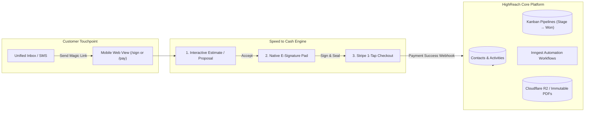
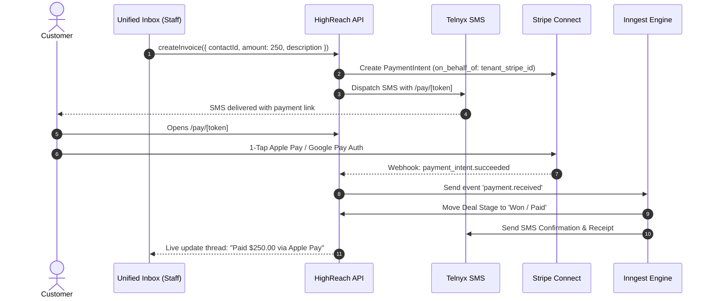

# HighReach Payments, Invoicing & E-Signatures Specification
## "Speed to Cash" Architecture & Implementation Guide

---

## 1. Executive Summary & Vision

In traditional agency CRMs like GoHighLevel (GHL), payments, quotes, and contracts are treated as separate, fragmented modules often requiring external integrations (DocuSign, PandaDoc, QuickBooks) or cumbersome multi-step configuration.

For HighReach’s target market—**local SMBs, high-velocity agencies, and service contractors**—the single greatest friction point between closing a deal and getting funded is latency. HighReach solves this through an integrated **"Speed to Cash" Engine**:
- **Text-to-Pay in Seconds**: Instantly issue a payment link or deposit invoice right from the Unified Inbox over SMS (Telnyx) or Email (Resend) with 1-tap Apple Pay / Google Pay checkout.
- **Interactive Proposals & Estimates**: Line-item estimates that leads can review, customize with optional add-ons, and approve with a single tap.
- **Native E-Signatures (DocuSign Alternative)**: Mobile-optimized, legally binding electronic signatures (ESIGN & UETA compliant) with cryptographic audit certificates, automated reminders, and zero per-envelope fees.
- **Automated Pipeline & Workflow Progression**: Instant deal progression on Kanban pipelines, automated client onboarding triggers via Inngest, and verified contact activity logging.



---

## 2. Core Architecture & Tech Stack

| Layer | Technology | Rationale & Responsibility |
| :--- | :--- | :--- |
| **Payment Gateway** | **Stripe Connect (Express/Custom)** | Multi-tenant merchant onboarding, direct payout routing to tenant bank accounts, 0 liability for card data, automated 1099/KYC handling. |
| **Mobile Checkout** | **Stripe Payment Element & Checkout** | Native Apple Pay, Google Pay, credit/debit cards, ACH Direct Debit, and Link 1-click checkout. |
| **PDF Generation** | **`@react-pdf/renderer` + `pdf-lib`** | Server-side PDF invoice rendering, dynamic contract stamping, and signing certificate page generation. |
| **Signature Capture** | **HTML5 Canvas / Vector Signature** | Mobile-first touch/stylus signature drawing, typed cursive fallback, and high-resolution vector SVG/PNG extraction. |
| **Document Storage** | **Cloudflare R2 (S3-Compatible)** | Immutable, cryptographically hashed PDF storage with signed expiring download URLs. |
| **Background Orchestration** | **Inngest** | Event-driven triggers (`payment.received`, `contract.signed`, `invoice.overdue`), automated payment reminders, and pipeline transitions. |
| **Database & ORM** | **PostgreSQL + Drizzle ORM** | Multi-tenant schema with strict tenant isolation via RLS and foreign-key cascading. |

---

## 3. Database Schema Design (Drizzle ORM)

Below is the database schema to be added to `web/src/lib/db/schema.ts`.

```typescript
import {
    pgTable,
    uuid,
    text,
    timestamp,
    boolean,
    integer,
    numeric,
    jsonb,
    index,
    uniqueIndex,
} from "drizzle-orm/pg-core";
import { tenants, contacts, users, opportunities } from "./schema";

// ── 1. Merchant Payment Accounts (Stripe Connect) ─────────────
export const paymentAccounts = pgTable("payment_accounts", {
    id: uuid("id").primaryKey().defaultRandom(),
    tenantId: uuid("tenant_id").references(() => tenants.id, { onDelete: "cascade" }).notNull(),
    provider: text("provider").default("stripe_connect").notNull(),
    stripeAccountId: text("stripe_account_id").notNull().unique(),
    chargesEnabled: boolean("charges_enabled").default(false).notNull(),
    payoutsEnabled: boolean("payouts_enabled").default(false).notNull(),
    detailsSubmitted: boolean("details_submitted").default(false).notNull(),
    defaultCurrency: text("default_currency").default("usd").notNull(),
    statementDescriptor: text("statement_descriptor"),
    metadata: jsonb("metadata").default({}),
    createdAt: timestamp("created_at", { withTimezone: true }).defaultNow().notNull(),
    updatedAt: timestamp("updated_at", { withTimezone: true }).defaultNow().notNull(),
}, (table) => [
    index("idx_payment_accounts_tenant").on(table.tenantId),
    uniqueIndex("uniq_payment_accounts_stripe").on(table.stripeAccountId),
]);

// ── 2. Product / Service Catalog ──────────────────────────────
export const catalogItems = pgTable("catalog_items", {
    id: uuid("id").primaryKey().defaultRandom(),
    tenantId: uuid("tenant_id").references(() => tenants.id, { onDelete: "cascade" }).notNull(),
    name: text("name").notNull(),
    description: text("description"),
    sku: text("sku"),
    unitPrice: numeric("unit_price", { precision: 12, scale: 2 }).notNull(),
    currency: text("currency").default("usd").notNull(),
    isTaxable: boolean("is_taxable").default(true).notNull(),
    isActive: boolean("is_active").default(true).notNull(),
    createdAt: timestamp("created_at", { withTimezone: true }).defaultNow().notNull(),
    updatedAt: timestamp("updated_at", { withTimezone: true }).defaultNow().notNull(),
}, (table) => [
    index("idx_catalog_items_tenant").on(table.tenantId),
]);

// ── 3. Invoices ───────────────────────────────────────────────
export const invoices = pgTable("invoices", {
    id: uuid("id").primaryKey().defaultRandom(),
    tenantId: uuid("tenant_id").references(() => tenants.id, { onDelete: "cascade" }).notNull(),
    contactId: uuid("contact_id").references(() => contacts.id, { onDelete: "cascade" }).notNull(),
    opportunityId: uuid("opportunity_id").references(() => opportunities.id, { onDelete: "set null" }),
    invoiceNumber: text("invoice_number").notNull(), // e.g., INV-1001
    status: text("status").default("draft").notNull(), // 'draft' | 'sent' | 'viewed' | 'partially_paid' | 'paid' | 'overdue' | 'void'
    issueDate: timestamp("issue_date", { withTimezone: true }).defaultNow().notNull(),
    dueDate: timestamp("due_date", { withTimezone: true }).notNull(),
    subtotal: numeric("subtotal", { precision: 12, scale: 2 }).notNull(),
    taxRate: numeric("tax_rate", { precision: 5, scale: 2 }).default("0.00").notNull(),
    taxAmount: numeric("tax_amount", { precision: 12, scale: 2 }).default("0.00").notNull(),
    discountAmount: numeric("discount_amount", { precision: 12, scale: 2 }).default("0.00").notNull(),
    totalAmount: numeric("total_amount", { precision: 12, scale: 2 }).notNull(),
    amountPaid: numeric("amount_paid", { precision: 12, scale: 2 }).default("0.00").notNull(),
    amountDue: numeric("amount_due", { precision: 12, scale: 2 }).notNull(),
    currency: text("currency").default("usd").notNull(),
    accessToken: text("access_token").notNull().unique(), // Secure magic link token
    paymentUrl: text("payment_url"),
    stripePaymentIntentId: text("stripe_payment_intent_id"),
    stripeClientSecret: text("stripe_client_secret"),
    notes: text("notes"),
    termsAndConditions: text("terms_and_conditions"),
    paidAt: timestamp("paid_at", { withTimezone: true }),
    sentAt: timestamp("sent_at", { withTimezone: true }),
    viewedAt: timestamp("viewed_at", { withTimezone: true }),
    createdAt: timestamp("created_at", { withTimezone: true }).defaultNow().notNull(),
    updatedAt: timestamp("updated_at", { withTimezone: true }).defaultNow().notNull(),
}, (table) => [
    index("idx_invoices_tenant").on(table.tenantId),
    index("idx_invoices_contact").on(table.contactId),
    index("idx_invoices_status").on(table.tenantId, table.status),
    uniqueIndex("uniq_invoice_number_tenant").on(table.tenantId, table.invoiceNumber),
    uniqueIndex("uniq_invoice_access_token").on(table.accessToken),
]);

// ── 4. Invoice Line Items ─────────────────────────────────────
export const invoiceItems = pgTable("invoice_items", {
    id: uuid("id").primaryKey().defaultRandom(),
    invoiceId: uuid("invoice_id").references(() => invoices.id, { onDelete: "cascade" }).notNull(),
    tenantId: uuid("tenant_id").references(() => tenants.id, { onDelete: "cascade" }).notNull(),
    catalogItemId: uuid("catalog_item_id").references(() => catalogItems.id, { onDelete: "set null" }),
    name: text("name").notNull(),
    description: text("description"),
    quantity: numeric("quantity", { precision: 10, scale: 2 }).default("1.00").notNull(),
    unitPrice: numeric("unit_price", { precision: 12, scale: 2 }).notNull(),
    amount: numeric("amount", { precision: 12, scale: 2 }).notNull(),
    orderIndex: integer("order_index").default(0).notNull(),
    createdAt: timestamp("created_at", { withTimezone: true }).defaultNow().notNull(),
}, (table) => [
    index("idx_invoice_items_invoice").on(table.invoiceId),
]);

// ── 5. Payment Transactions ───────────────────────────────────
export const paymentTransactions = pgTable("payment_transactions", {
    id: uuid("id").primaryKey().defaultRandom(),
    tenantId: uuid("tenant_id").references(() => tenants.id, { onDelete: "cascade" }).notNull(),
    invoiceId: uuid("invoice_id").references(() => invoices.id, { onDelete: "cascade" }).notNull(),
    contactId: uuid("contact_id").references(() => contacts.id, { onDelete: "cascade" }).notNull(),
    amount: numeric("amount", { precision: 12, scale: 2 }).notNull(),
    currency: text("currency").default("usd").notNull(),
    status: text("status").notNull(), // 'succeeded' | 'pending' | 'failed' | 'refunded'
    paymentMethod: text("payment_method").notNull(), // 'card' | 'apple_pay' | 'google_pay' | 'ach' | 'cash'
    stripeChargeId: text("stripe_charge_id"),
    stripePaymentIntentId: text("stripe_payment_intent_id"),
    receiptUrl: text("receipt_url"),
    cardBrand: text("card_brand"), // 'visa' | 'mastercard' | 'amex'
    cardLast4: text("card_last4"),
    errorMessage: text("error_message"),
    createdAt: timestamp("created_at", { withTimezone: true }).defaultNow().notNull(),
}, (table) => [
    index("idx_payment_transactions_tenant").on(table.tenantId),
    index("idx_payment_transactions_invoice").on(table.invoiceId),
    index("idx_payment_transactions_contact").on(table.contactId),
]);

// ── 6. Contracts, Proposals & E-Signatures ────────────────────
export const documents = pgTable("documents", {
    id: uuid("id").primaryKey().defaultRandom(),
    tenantId: uuid("tenant_id").references(() => tenants.id, { onDelete: "cascade" }).notNull(),
    contactId: uuid("contact_id").references(() => contacts.id, { onDelete: "cascade" }).notNull(),
    opportunityId: uuid("opportunity_id").references(() => opportunities.id, { onDelete: "set null" }),
    invoiceId: uuid("invoice_id").references(() => invoices.id, { onDelete: "set null" }), // Optional linked deposit/invoice
    title: text("title").notNull(),
    type: text("type").default("contract").notNull(), // 'contract' | 'proposal' | 'estimate' | 'service_agreement' | 'nda'
    status: text("status").default("draft").notNull(), // 'draft' | 'sent' | 'viewed' | 'signed' | 'declined' | 'expired'
    contentJson: jsonb("content_json").notNull(), // Block-based rich content (headings, terms, tables)
    contentHtml: text("content_html"),
    rawPdfUrl: text("raw_pdf_url"), // Unsigned original PDF
    signedPdfUrl: text("signed_pdf_url"), // Stamped, signed & certified PDF
    documentHash: text("document_hash"), // SHA-256 hash of signed document
    accessToken: text("access_token").notNull().unique(), // Secure magic link token
    expiresAt: timestamp("expires_at", { withTimezone: true }),
    sentAt: timestamp("sent_at", { withTimezone: true }),
    viewedAt: timestamp("viewed_at", { withTimezone: true }),
    signedAt: timestamp("signed_at", { withTimezone: true }),
    createdBy: uuid("created_by").references(() => users.id),
    createdAt: timestamp("created_at", { withTimezone: true }).defaultNow().notNull(),
    updatedAt: timestamp("updated_at", { withTimezone: true }).defaultNow().notNull(),
}, (table) => [
    index("idx_documents_tenant").on(table.tenantId),
    index("idx_documents_contact").on(table.contactId),
    uniqueIndex("uniq_documents_access_token").on(table.accessToken),
]);

// ── 7. Document Signers ───────────────────────────────────────
export const documentSigners = pgTable("document_signers", {
    id: uuid("id").primaryKey().defaultRandom(),
    documentId: uuid("document_id").references(() => documents.id, { onDelete: "cascade" }).notNull(),
    tenantId: uuid("tenant_id").references(() => tenants.id, { onDelete: "cascade" }).notNull(),
    contactId: uuid("contact_id").references(() => contacts.id, { onDelete: "set null" }),
    name: text("name").notNull(),
    email: text("email").notNull(),
    role: text("role").default("signer").notNull(), // 'signer' | 'counter_signer' | 'viewer'
    signingOrder: integer("signing_order").default(1).notNull(),
    status: text("status").default("pending").notNull(), // 'pending' | 'viewed' | 'signed' | 'declined'
    signatureDataUrl: text("signature_data_url"), // Base64 PNG/SVG vector representation
    ipAddress: text("ip_address"),
    userAgent: text("user_agent"),
    signedAt: timestamp("signed_at", { withTimezone: true }),
    createdAt: timestamp("created_at", { withTimezone: true }).defaultNow().notNull(),
}, (table) => [
    index("idx_document_signers_document").on(table.documentId),
]);

// ── 8. ESIGN / UETA Compliance Audit Logs ─────────────────────
export const documentAuditLogs = pgTable("document_audit_logs", {
    id: uuid("id").primaryKey().defaultRandom(),
    documentId: uuid("document_id").references(() => documents.id, { onDelete: "cascade" }).notNull(),
    tenantId: uuid("tenant_id").references(() => tenants.id, { onDelete: "cascade" }).notNull(),
    action: text("action").notNull(), // 'created' | 'sent' | 'viewed' | 'signature_drawn' | 'signed' | 'certificate_generated'
    actorEmail: text("actor_email").notNull(),
    actorRole: text("role").notNull(), // 'client' | 'agent' | 'system'
    ipAddress: text("ip_address"),
    userAgent: text("user_agent"),
    metadata: jsonb("metadata").default({}),
    timestamp: timestamp("timestamp", { withTimezone: true }).defaultNow().notNull(),
}, (table) => [
    index("idx_document_audit_logs_document").on(table.documentId),
]);
```

---

## 4. Feature Deep Dive & Technical Workflows

### 4.1 "Speed to Cash": Text-to-Pay from Unified Inbox

The hallmark of HighReach is enabling a business owner or agent to convert a phone call or chat directly into money within seconds.

#### The Agent Experience
1. Inside the **Unified Inbox** (`/dashboard/inbox`), the agent clicks the **"Request Payment"** button (`CreditCard` icon) below the composer.
2. A quick modal appears:
   - Quick Select Item from Catalog (e.g. *"Emergency Drain Snaking — $250.00"*) or enter Custom Amount.
   - Attach optional Due Date or Note.
3. Clicking **"Send via SMS"**:
   - Generates an `invoices` record with an encrypted unique `accessToken`.
   - Dispatches a personalized SMS via Telnyx:
     > *"Hi John, your invoice from Acme Plumbing for $250.00 is ready. Tap here to view & pay with Apple Pay: https://reach.io/pay/inv_x9f2..."*
   - Inserts a message bubble with payment preview into the conversation thread.

#### The Customer Experience (Mobile-First)
1. Customer taps the link $\to$ opens `/pay/[token]`.
2. Responsive, branded, distraction-free page loads in $<500\text{ms}$.
3. Stripe Payment Element auto-detects Apple Pay (iOS Safari) or Google Pay (Android Chrome).
4. Customer authenticates with **FaceID / TouchID / 1-Tap**.
5. Transaction confirms instantly. A receipt is automatically emailed/SMSed.



---

### 4.2 Native E-Signatures & Document Builder

Traditional e-signature providers charge $25–$50/user/month or $2–$5 per envelope. HighReach provides **native, unlimited e-signatures** with zero variable per-envelope cost.

#### 1. Document Template & Variable Merge Engine
Templates support rich dynamic variables that pull automatically from the CRM context:
- `{{contact.first_name}}`, `{{contact.last_name}}`, `{{contact.company}}`
- `{{tenant.name}}`, `{{tenant.phone}}`
- `{{opportunity.title}}`, `{{invoice.total_amount}}`
- `{{today.date}}`

#### 2. The Signature Pad Component
- Built using an optimized HTML5 Vector Canvas.
- Offers two modes:
  1. **Draw**: Smooth Bézier curves with pressure/velocity smoothing for realistic pen strokes.
  2. **Type**: Generates stylized cursive signatures with customizable typography fonts (Caveat, Dancing Script, Sacramento).
- Requires explicit acceptance of the **ESIGN Act Disclosure**:
  > *"By clicking 'Adopt and Sign', I agree that my electronic signature constitutes a legally binding signature under the Federal ESIGN Act and UETA."*

#### 3. Cryptographic Audit Certificate & PDF Stamping
Upon final execution, the system performs a multi-step sealing process:
1. **Stamp Visual Signature**: Injects the signer’s vector signature and timestamp into designated coordinates on the document via `pdf-lib`.
2. **Generate Completion Certificate**: Appends a permanent, immutable final page containing:
   - Document ID and Title.
   - Signer Name and Verified Email Address.
   - Cryptographic SHA-256 Digest of the un-signed and signed document.
   - Verified IP Address and Browser User-Agent.
   - Timestamp with Millisecond Precision and UTC offset.
3. **Immutable Archive**: Writes the completed PDF to Cloudflare R2 bucket (`contracts/{tenant_id}/{document_id}.pdf`).
4. **Lock Record**: Sets `documents.status = 'signed'` and prevents any subsequent modifications.

---

### 4.3 Interactive Proposals & Estimates

For service contractors and agencies, quotes are rarely fixed. HighReach supports **Dynamic Interactive Proposals**:
- **Line Items with Toggleable Add-ons**:
  - Example: *Standard Roof Inspection ($0)* + *Gutter Cleaning ($150 - [Toggle Checkbox])* + *Moss Treatment ($300 - [Toggle Checkbox])*.
- **Real-time Subtotal Recalculation**: The client checks/unchecks options, and the total updates dynamically on the screen.
- **1-Click "Accept Proposal & Sign Agreement"**: Transitions seamlessly from quote review to signature pad to payment link.

---

## 5. Inngest Workflow Automation Integration

Payments and documents emit first-class Inngest events, allowing automated trigger sequences in HighReach's visual workflow canvas (`/dashboard/automations`):

### Event Schemas

```typescript
// 1. Payment Received
type PaymentReceivedEvent = {
    name: "payment.received";
    data: {
        tenantId: string;
        invoiceId: string;
        contactId: string;
        amount: number;
        currency: string;
        paymentMethod: string;
        opportunityId?: string;
    };
};

// 2. Document Signed
type DocumentSignedEvent = {
    name: "document.signed";
    data: {
        tenantId: string;
        documentId: string;
        contactId: string;
        signerName: string;
        signerEmail: string;
        signedPdfUrl: string;
        opportunityId?: string;
    };
};

// 3. Invoice Overdue
type InvoiceOverdueEvent = {
    name: "invoice.overdue";
    data: {
        tenantId: string;
        invoiceId: string;
        contactId: string;
        amountDue: number;
        dueDate: string;
    };
};
```

### Automated Recipe Examples
1. **The Instant Close Recipe**:
   - `Trigger`: `document.signed`
   - `Action 1`: Advance Kanban Opportunity to stage *"Contract Signed"*.
   - `Action 2`: If linked invoice exists, send SMS: *"Thanks for signing! Here is the link to complete your deposit: {{invoice.payment_url}}"*.
2. **The Paid-in-Full Onboarding Recipe**:
   - `Trigger`: `payment.received`
   - `Action 1`: Advance Kanban Opportunity to stage *"Closed Won"*.
   - `Action 2`: Assign CRM Tag `["customer", "paid"]`.
   - `Action 3`: Send Welcome Email via Resend with client onboarding questionnaire.
   - `Action 4`: Post message in internal staff thread on Unified Inbox.
3. **Overdue Dunning Automation**:
   - `Trigger`: `invoice.overdue`
   - `Wait`: 24 Hours.
   - `Action`: Send gentle reminder SMS: *"Hi {{contact.first_name}}, friendly reminder that invoice #{{invoice.number}} was due on {{invoice.due_date}}. Tap here to pay: {{invoice.payment_url}}"*.

---

## 6. Security, Legal & Compliance Standards

### 6.1 PCI-DSS Compliance (Zero-Card-Data Footprint)
HighReach never processes, transmits, or stores raw credit card numbers or CVVs on its servers.
- All card inputs are hosted inside secure **Stripe Elements iframes**.
- Server Actions only handle tokenized `PaymentIntent` IDs and Stripe customer tokens.
- SAQ-A compliant by architectural design.

### 6.2 ESIGN Act & UETA Compliance (E-Signatures)
Under the **U.S. Electronic Signatures in Global and National Commerce Act (ESIGN)** (15 U.S.C. § 7001) and the **Uniform Electronic Transactions Act (UETA)**, electronic signatures hold the same legal standing as wet-ink signatures when five statutory criteria are satisfied:

| Requirement | How HighReach Satisfies It |
| :--- | :--- |
| **1. Intent to Sign** | Explicit "Adopt and Sign" button action with signature preview. |
| **2. Consent to Electronic Business** | Mandatory disclosure checkbox before signature pad is enabled. |
| **3. Association of Signature with Record** | Cryptographic hash and visual signature permanently baked into the PDF binary via `pdf-lib`. |
| **4. Tamper-Evident Integrity** | SHA-256 document checksum recorded on the completion certificate. Any modification invalidates the digest. |
| **5. Audit Trail & Retention** | Complete timestamped log of IP addresses, user agents, email verifications, and immutable R2 storage. |

---

## 7. Implementation Roadmap & Milestones

### Phase 1: Stripe Connect & Text-to-Pay Foundation (Days 1–5)
- [ ] Add `payment_accounts`, `invoices`, `invoice_items`, and `payment_transactions` tables to Drizzle schema.
- [ ] Implement Stripe Connect OAuth onboarding flow in `/dashboard/settings/payments`.
- [ ] Build `/api/webhooks/stripe` route with webhook signature verification.
- [ ] Build **"Request Payment" Modal** in Unified Inbox.
- [ ] Build public mobile-first payment page at `/pay/[token]` with Apple Pay / Google Pay.
- [ ] Auto-log payment events to `contact_activities` and Unified Inbox thread.

### Phase 2: Invoicing & Catalog Center (Days 6–12)
- [ ] Create `/dashboard/payments` dashboard hub (Overview, Invoices, Transactions, Items).
- [ ] Implement Product/Service Catalog management with CSV export/import.
- [ ] Build full-featured Invoice Editor with line items, tax rates, and discount calculations.
- [ ] Implement PDF Invoice generation (`@react-pdf/renderer`) with download and email dispatch.
- [ ] Inngest cron job to check and mark overdue invoices.

### Phase 3: E-Signatures & Document Builder (Days 13–20)
- [ ] Add `documents`, `document_signers`, and `document_audit_logs` tables to Drizzle schema.
- [ ] Create `/dashboard/documents` hub for tracking Proposals, Estimates, and Contracts.
- [ ] Build Drag & Drop / Rich Document Builder with CRM merge tags.
- [ ] Build public signing experience at `/sign/[token]` with canvas signature pad.
- [ ] Implement server-side PDF stamping and cryptographic Certificate of Completion generator.
- [ ] Cloudflare R2 bucket integration for archiving final signed documents.

### Phase 4: Workflow Triggers & CRM Automation (Days 21–25)
- [ ] Register `payment.received`, `document.signed`, `document.viewed`, and `invoice.overdue` in Inngest event registry.
- [ ] Add pre-built workflow templates in `/dashboard/automations`:
  - "Move Deal to Won on Deposit"
  - "Send Onboarding Form on Contract Signed"
  - "Automated Overdue Invoice Dunning"
- [ ] Add interactive payment and signature test sandbox for staging verification.

---

## 8. Verification & Testing Strategy

```bash
# 1. Run unit tests for invoice math, tax calculation & token validation
cd web && pnpm test

# 2. Verify Stripe Webhook Handling locally
stripe listen --forward-to localhost:3000/api/webhooks/stripe

# 3. Verify TypeScript Type Safety
pnpm tsc --noEmit
```

### Unit Test Matrix (`__tests__/payments.test.ts` & `__tests__/documents.test.ts`)
1. **Invoice Calculations**:
   - Correct subtotal with fractional quantities.
   - Correct percentage tax calculation ($100 \times 8.25\% = \$108.25$).
   - Proper rounding and negative discount safeguards.
2. **Access Token Security**:
   - Reject expired tokens.
   - Reject tampered tokens.
   - Enforce tenant isolation on public endpoints.
3. **E-Signature Integrity**:
   - Verify SHA-256 checksum matches before and after stamping.
   - Ensure certificate page contains non-empty IP address, timestamp, and signer metadata.
