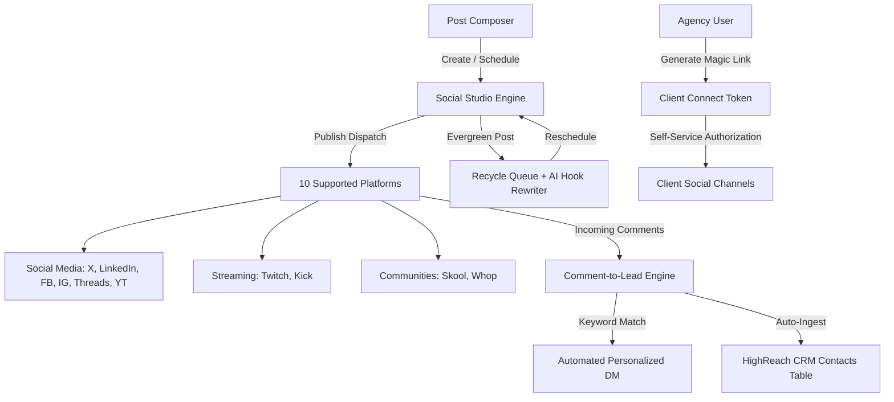

# HighReach Social Studio — Architectural Specification & Guide

## 1. Overview & Vision

**HighReach Social Studio** is an omnichannel social media scheduling, content generation, and lead conversion engine built natively into HighReach. Beyond replicating the core features of open-source schedulers like **Postiz**, Social Studio serves as a high-velocity **lead generation magnet** for SMBs and marketing agencies by turning social engagement directly into CRM contacts and closed pipeline.



---

## 2. Feature Comparison: Postiz vs HighReach Social Studio

| Capability | Postiz Latest | HighReach Social Studio |
| :--- | :--- | :--- |
| **Supported Channels** | Twitter, LinkedIn, FB, IG, Threads, YouTube, Twitch, Kick | **10 Channels**: Twitter, LinkedIn, FB, IG, Threads, YouTube, Twitch, Kick + **Skool & Whop Communities** |
| **Comment-to-Lead Engine** | ❌ Not available (Basic DM webhook) | **Native Engine**: Case-insensitive keyword matching, dynamic `{name}` / `{handle}` personalization, resource link delivery, and **instant injection into HighReach CRM (`contacts`)**. |
| **Live Lead Simulator** | ❌ Not available | **Interactive Playground**: Test any keyword against custom comments and observe real-time DM formatting and CRM contact ingestion in the analytics modal. |
| **Evergreen Content Queue** | ⚠️ Basic reposting | **Intelligent Recycling**: Configurable interval days & loops with **AI Hook Rewriter** to bypass duplicate content penalties. |
| **Client Social Connect** | ⚠️ Standard invitation | **Passwordless Magic Links**: Tokenized links allowing external agency clients to connect their social accounts without passwords or workspace logins. |
| **Document / Carousel Builder** | ❌ Not available | **Multi-Page Carousel Generator**: Built-in slide editor with 4 color gradient themes (Modern Dark, Ocean Royal, Sunset Crimson, Forest Emerald) and interactive swiper previews. |
| **Consistency Streak** | Daily streak counter | **Daily Posting Streak**: `calculatePostingStreak` with visual header badge (`🔥 X Day Streak`), at-risk detection, and 6 PM reminder alerts. |
| **Single Post Analytics** | Hover stats icon | **Dedicated Analytics Modal**: Views, Engagements, CTR %, platform breakdowns, and simulation tools. |
| **Global Settings Editor** | Global channel settings | **Tenant Social Settings**: Configurable short-linking (`Always`, `Never`, `Ask`), custom queue slot presets, and default tags. |
| **Batch Media Upload** | Batch file upload | **Unlimited Batch Media**: Batch URL parsing from comma-, whitespace-, or newline-separated lists with full-screen Lightbox zoom. |

---

## 3. Flagship 2026 Feature Deep Dive

### 3.1 Comment-to-Lead / Comment-to-DM Engine
- **Purpose**: Converts post comments (e.g., *"Comment 'GUIDE' below to get the checklist"*) into automated DMs and qualified CRM leads.
- **Matching Algorithm** (`processCommentToLead` in `social-utils.ts`):
  - Strips non-alphanumeric noise and performs tokenized whole-word or exact match against `triggerKeyword` (case-insensitive).
  - Dynamically replaces `{name}` and `{handle}` in the template string with commenter metadata.
  - Automatically appends resource download links.
- **CRM Ingestion** (`triggerCommentToLeadSimulation` in `social.service.ts`):
  - Directly creates or updates records in HighReach's `contacts` table with tags: `["social-lead", "keyword-{keyword}"]`.
  - Records notes indicating the platform, handle, and message delivered.

### 3.2 Skool & Whop Community Schedulers
- **Skool Support**: 10,000 character limit, brand color `#F59E0B`. Interactive preview showcases community category tags, admin badges, and upvote counters.
- **Whop Support**: 5,000 character limit, brand color `#FF5C35`. Interactive preview displays member perks, storefront tags, and reactions.

### 3.3 Evergreen Recycling Queue & AI Hook Rewriting
- **Recycle Logic** (`calculateEvergreenNextDate`):
  - Automatically schedules the next dispatch `intervalDays` in the future, locked to the tenant's preferred morning queue slot (`09:00 AM`).
  - Increments `recyclesCount` and respects `maxRecycles` (or infinite if `0`).
- **AI Hook Rewriter** (`generateAiHookVariation`):
  - Preserves post body and bullet points while dynamically selecting a high-converting opening hook to keep social network algorithms from demoting repeated content.

### 3.4 Client Social Connect Magic Links ("Add Channels Without Login")
- **Token Format**: Secure, URL-safe Base64URL string (`hr_sc_...`) carrying tenant ID, client email, and expiration timestamp.
- **Agency Workflow**:
  1. Agency navigates to **Accounts** tab $\rightarrow$ clicks **"Invite Client to Connect"**.
  2. Enters client email and generates a 7-day magic link.
  3. Client opens the standalone link and authenticates their social channels directly without needing HighReach login credentials.

### 3.5 LinkedIn Carousel / Slide Deck Builder
- **Slide Management**: Add, delete, and edit slide titles and bulleted bodies directly in the composer.
- **Themes**:
  - `Modern Dark`: Slate to black gradient with electric cyan accent.
  - `Ocean Royal`: Navy to indigo gradient with vibrant sky accent.
  - `Sunset Crimson`: Deep rose to dark burgundy with amber accent.
  - `Forest Emerald`: Emerald to teal gradient with mint accent.
- **Preview**: Interactive swiper component with responsive slide indicators, previous/next controls, and live count (`Slide 1 of 4`).

---

## 4. Data Model & TypeScript Schemas

All schemas reside in [`web/src/lib/types/database.ts`](file:///Users/zayn/ground/highreach/web/src/lib/types/database.ts):

```typescript
export type SocialPlatform =
    | "twitter"
    | "linkedin"
    | "facebook"
    | "instagram"
    | "threads"
    | "youtube"
    | "twitch"
    | "kick"
    | "skool"
    | "whop";

export interface CommentToLeadSettings {
    enabled: boolean;
    triggerKeyword: string;
    dmMessage: string;
    resourceUrl?: string;
    autoCreateContact?: boolean;
}

export interface EvergreenSettings {
    enabled: boolean;
    recycleIntervalDays: number;
    maxRecycles: number; // 0 = unlimited
    recyclesCount?: number;
    aiVariation?: boolean;
}

export interface CarouselSlide {
    id: string;
    title: string;
    body: string;
}

export interface CarouselSettings {
    enabled: boolean;
    slides: CarouselSlide[];
    theme?: "dark" | "blue" | "crimson" | "emerald";
}

export interface SocialPostSettings {
    shortLinking?: "always" | "never" | "ask";
    thread?: string[];
    commentToLead?: CommentToLeadSettings;
    evergreen?: EvergreenSettings;
    carousel?: CarouselSettings;
}
```

---

## 5. Testing & Verification

Unit tests are located in [`web/src/__tests__/social.test.ts`](file:///Users/zayn/ground/highreach/web/src/__tests__/social.test.ts) using the native Node.js test runner:

```bash
cd web
pnpm test
```

### Verified Scenarios:
1. Platform character limits and brand colors (Twitter 280, Twitch 500, Kick 500, Skool 10,000, Whop 5,000).
2. `processCommentToLead` keyword evaluation, case-insensitivity, and personalized DM formatting.
3. `calculateEvergreenNextDate` interval calculation and 9:00 AM slot assignment.
4. `generateAiHookVariation` dynamic variation generation.
5. `calculatePostingStreak` streak tracking, breaks, and at-risk condition detection.
6. `CAROUSEL_THEMES` contrast and palette definitions.
